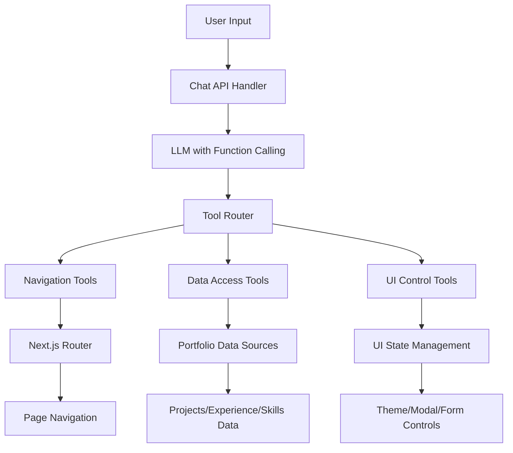

# Design Document

## Overview

The AI Portfolio Navigator will transform the existing chatbot into an intelligent assistant that can navigate and control the portfolio website using dedicated tools. Instead of relying on static knowledge or RAG, the chatbot will use function calling to access real-time portfolio data and perform navigation actions through Next.js routing and UI interactions.

## Architecture

### High-Level Architecture



### Tool Categories

1. **Navigation Tools**: Handle routing and page navigation
2. **Data Access Tools**: Retrieve portfolio information
3. **UI Control Tools**: Manage interface interactions
4. **Context Tools**: Provide current page/state information

## Components and Interfaces

### 1. Enhanced Chat API (`/api/chat`)

**Current State**: Basic OpenAI chat completion
**Enhanced State**: Function calling with tool execution

```typescript
interface ChatRequest {
  message: string;
  conversationHistory: Message[];
  currentPage?: string;
  currentTheme?: 'light' | 'dark';
}

interface ChatResponse {
  response: string;
  actions?: NavigationAction[];
  toolCalls?: ToolCall[];
}

interface ToolCall {
  id: string;
  name: string;
  arguments: Record<string, any>;
  result: any;
}
```

### 2. Tool System Architecture

**Base Tool Interface**:
```typescript
interface PortfolioTool {
  name: string;
  description: string;
  parameters: JSONSchema;
  execute: (args: any, context: ToolContext) => Promise<any>;
}

interface ToolContext {
  currentPage: string;
  theme: 'light' | 'dark';
  userAgent: string;
  sessionId: string;
}
```

### 3. Navigation Tools

**NavigateToPage Tool**:
```typescript
interface NavigateToPageArgs {
  page: 'home' | 'about' | 'projects' | 'resume';
  section?: string;
  smooth?: boolean;
}
```

**OpenModal Tool**:
```typescript
interface OpenModalArgs {
  modal: 'contact' | 'project-details';
  data?: Record<string, any>;
}
```

### 4. Data Access Tools

**GetProjects Tool**:
```typescript
interface GetProjectsArgs {
  category?: string;
  technology?: string;
  limit?: number;
  includeDetails?: boolean;
}

interface ProjectData {
  name: string;
  description: string;
  technologies: string[];
  category: string;
  images: string[];
  links: {
    live?: string;
    source?: string;
  };
}
```

**GetExperience Tool**:
```typescript
interface GetExperienceArgs {
  company?: string;
  role?: string;
  dateRange?: {
    start?: string;
    end?: string;
  };
}
```

**GetSkills Tool**:
```typescript
interface GetSkillsArgs {
  category?: string;
  search?: string;
}
```

### 5. UI Control Tools

**ToggleTheme Tool**:
```typescript
interface ToggleThemeArgs {
  theme?: 'light' | 'dark' | 'toggle';
}
```

**TriggerDownload Tool**:
```typescript
interface TriggerDownloadArgs {
  file: 'resume';
  format?: 'pdf';
}
```

## Data Models

### Tool Registry
```typescript
class ToolRegistry {
  private tools: Map<string, PortfolioTool> = new Map();
  
  register(tool: PortfolioTool): void;
  get(name: string): PortfolioTool | undefined;
  getAll(): PortfolioTool[];
  getSchemas(): Record<string, JSONSchema>;
}
```

### Navigation State Manager
```typescript
class NavigationStateManager {
  getCurrentPage(): string;
  getCurrentSection(): string | null;
  getTheme(): 'light' | 'dark';
  navigateTo(page: string, section?: string): Promise<void>;
  openModal(modal: string, data?: any): Promise<void>;
  closeModal(): Promise<void>;
}
```

### Data Access Layer
```typescript
class PortfolioDataAccess {
  getProjects(filters?: ProjectFilters): ProjectData[];
  getExperience(filters?: ExperienceFilters): ExperienceData[];
  getSkills(filters?: SkillFilters): SkillData[];
  getPersonalInfo(): PersonalInfo;
  searchContent(query: string): SearchResult[];
}
```

## Error Handling

### Tool Execution Errors
- **Invalid Arguments**: Return structured error with correction suggestions
- **Navigation Failures**: Fallback to current page with error message
- **Data Access Errors**: Return partial data with error context
- **Permission Errors**: Graceful degradation with alternative suggestions

### Error Response Format
```typescript
interface ToolError {
  code: string;
  message: string;
  suggestions?: string[];
  fallback?: any;
}
```

### Graceful Degradation
1. **Tool Unavailable**: Fall back to static responses
2. **Navigation Blocked**: Provide alternative navigation suggestions
3. **Data Incomplete**: Return available data with disclaimers
4. **Theme Issues**: Continue with current theme

## Testing Strategy

### Unit Tests
- **Tool Functions**: Test each tool's execute method
- **Data Access**: Verify data retrieval and filtering
- **Navigation Logic**: Test routing and state management
- **Error Handling**: Validate error scenarios and fallbacks

### Integration Tests
- **Tool Chain Execution**: Test multiple tool calls in sequence
- **Navigation Flow**: End-to-end navigation scenarios
- **Data Consistency**: Verify data accuracy across tools
- **Chat Integration**: Test LLM function calling integration

### E2E Tests
- **User Scenarios**: Complete user interaction flows
- **Cross-Page Navigation**: Multi-page navigation sequences
- **Theme Switching**: Theme persistence across navigation
- **Mobile Responsiveness**: Touch and mobile-specific interactions

### Test Data Management
```typescript
interface TestScenario {
  name: string;
  userInput: string;
  expectedTools: string[];
  expectedNavigation?: NavigationAction;
  expectedResponse: string;
  context?: ToolContext;
}
```

## Implementation Phases

### Phase 1: Core Tool Infrastructure
- Tool registry and base interfaces
- Basic navigation tools (page routing)
- Data access tools for projects/experience/skills
- Enhanced chat API with function calling

### Phase 2: Advanced Navigation
- Modal control tools
- Section-specific navigation
- Theme management tools
- Download triggers

### Phase 3: Smart Context Awareness
- Current page detection
- Contextual tool suggestions
- Smart filtering and search
- Personalized responses based on location

### Phase 4: Enhanced User Experience
- Smooth animations during navigation
- Loading states for tool execution
- Error recovery mechanisms
- Performance optimizations

## Security Considerations

### Tool Access Control
- Whitelist allowed navigation targets
- Validate all tool arguments
- Rate limiting for tool execution
- Session-based tool access

### Data Protection
- No sensitive data exposure through tools
- Sanitize all user inputs
- Validate navigation permissions
- Secure modal data handling

### Client-Side Security
- CSP headers for navigation
- XSS prevention in tool responses
- Secure cookie handling for theme/state
- Input validation on all tool parameters