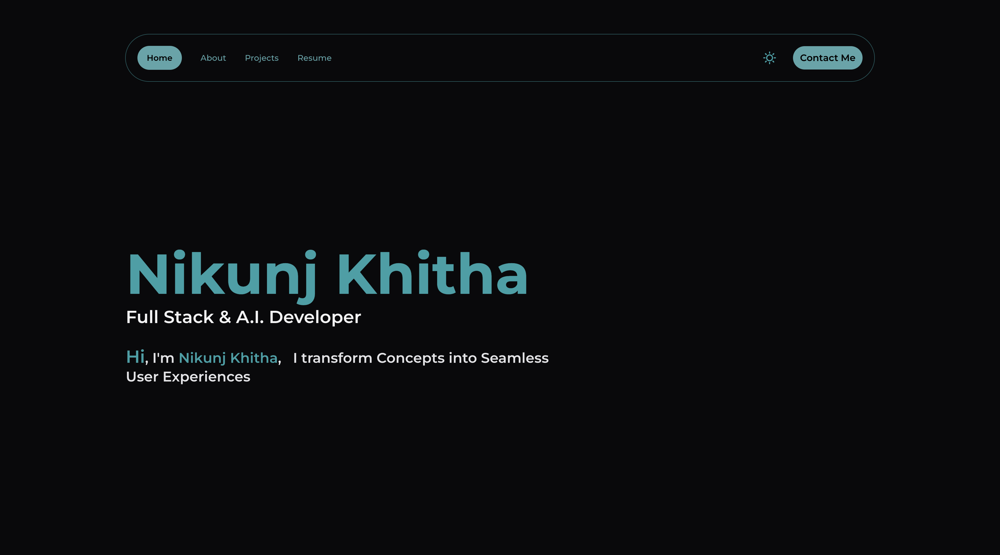

This portfolio is crafted using [Next.js](https://nextjs.org/)

## 📸 Screenshots



## 🖥️ Technologies Used

- [Nextjs.js](https://nextjs.org/) : A React-based, open-source framework for building efficient and scalable web applications.
- [Tailwind CSS](https://tailwindcss.com) : A utility-first CSS framework for rapid UI development.
- [TypeScript](https://www.typescriptlang.org): A typed superset of JavaScript that provides enhanced tooling and developer productivity.
- [Framer motion](https://www.framer.com/motion/): A React animation library that brings motion to your user interfaces.
- [Nodemailer](https://nodemailer.com/): A Node.js library facilitating easy email integration with features like attachment handling, HTML content, and support for various email services.
- [Vercel](https://vercel.com/): A platform for deploying and hosting front-end applications with seamless integration for Next.js.

### ✨ Seo

1. The project automatically generates sitemap.xml and robots.txt files within the public folder by leveraging the project's file structure. This process is initiated through the scripts located at src/scripts/generateSitemap.mjs, executed either after the project is built or by running the command `pnpm sitemap`.
2. It's important to note that [dynamic routes](https://nextjs.org/docs/pages/building-your-application/routing/dynamic-routes), identified by file or folder names in square brackets (e.g., [segmentName], [id], or [slug]), are excluded from the sitemap.xml.
3. Update google site verification code with your own inside `/src/data/siteMetaData.mjs`. Can be created for free using your google email id at <https://search.google.com/search-console/welcome>

## 🛠️ Development setup

### Step 1 - Install dependencies

```bash
npm install
```

### Step 2 - Set up Nodemailer

1. Create a `.env` file in the root of your project.
2. Add the following environment variables for Nodemailer setup:

```bash
NODEMAILER_USER=your-email@example.com
NODEMAILER_PASS=your-email-password
```

Make sure to replace `your-email@example.com` and `your-email-password` with the actual email and password you'll use for sending emails through Nodemailer.

### Step 3 - Run the development server

```bash
npm run dev
```

Open [http://localhost:3000](http://localhost:3000) with your browser to see the portfolio.